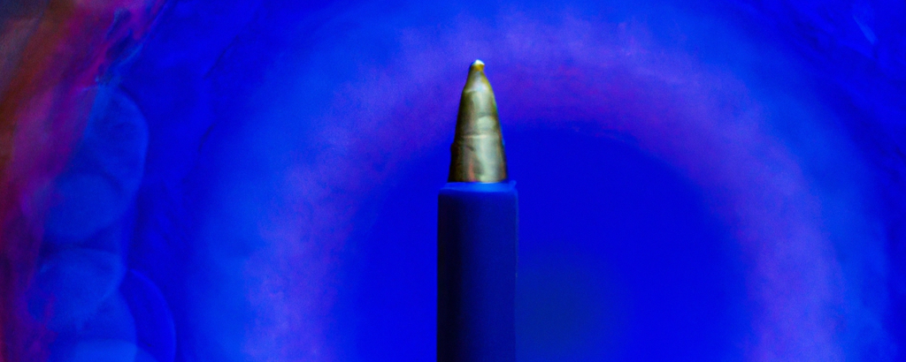

<picture></picture>

<h1 align="center"><b>Hi , I'm LapiceroAzul </b></h1>

</a>

## <picture></picture> **About me**

 

    <picture>
        <source media="(max-width: 767px)" srcset="">
        
    </picture>
        <h3>Coding for fun.</h3> 
        <ul>
            <li>Currently working as Data Scientist at <a href="https://www.linkedin.com/company/romboost/">Romboost</a>.</li>
            <li>Currently Data Engineering and Artificial Intelligence student.</li>
        </ul>

  

<h2 align="left">⚒️ Languages-Frameworks-Tools ⚒️</h2>

     
     
      

## <b> Github Stats </b>

 

  
  
   
  

 
 

## <b>Let's Connect..!</b>

 

    <picture>
        <source media="(max-width: 767px)" srcset="">
        
    </picture>
    <ul>
        <li></li>
    </ul>

 

